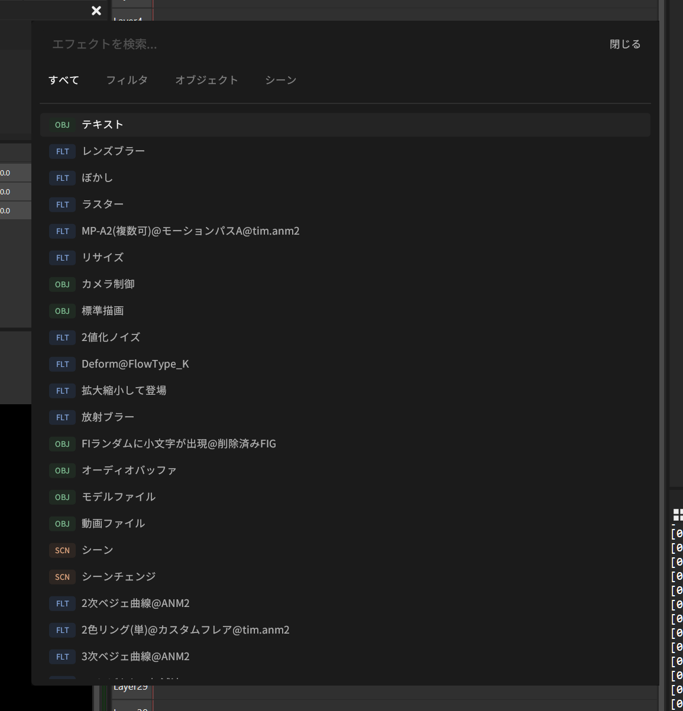

# HARUME Quick Search

AviUtl2 用のエフェクト検索プラグインです。  
After Effects のFX Consoleのように、素早く検索し追加できます。

# 特徴

### 使用頻度に応じた並び替え
* よく使うエフェクトは上位に表示されます。

### カテゴリ
* 「すべて」「フィルタ」「オブジェクト」「シーン」の4タブで素早く探す。

### キーボード操作
* 上下キー：選択
* Enter：追加
* Esc：ウインドウを閉じる
* 左右キー：タブ切り替え

  

# 使い方

1. 編集メニューから **`HARUME Quick Search \ Open Panel`** を選択します（ショートカットキーへの割り当てを推奨。おすすめは `E` キー）。
2. 検索ボックスにエフェクト名を入力します。
3. クリックまたは **Enter** キーで、選択中のオブジェクトやタイムラインにエフェクトが追加されます。

# 動作確認環境

* AviUtl2 beta47

※開発者の環境でのみテストしています。すべての環境での動作を保証するものではありません。

※ プラグインが読み込まれない場合、VC++ 再頒布可能パッケージ (x64) をインストールすると解決する可能性があります。

# 開発について

本プラグインのコード作成にあたっては、生成AIを活用した開発支援を受けています。

##ライセンス

## 本プロジェクト
MIT License (c) 2026 HARULAB  
詳細は `LICENSE` ファイルをご覧ください。

## クレジット
本プロジェクトでは以下のライブラリを利用しています。
* [AviUtl2 SDK (aviutl2-rs)](https://github.com/sevenc-nanashi/aviutl2-rs)
* [egui / eframe](https://github.com/emilk/egui)
* [windows-rs](https://github.com/microsoft/windows-rs)
* [serde](https://github.com/serde-rs/serde)

# 免責事項

本プラグインの使用によって生じたすべての障害・損害について、制作者は一切の責任を負いません。各自の責任においてご使用ください。
